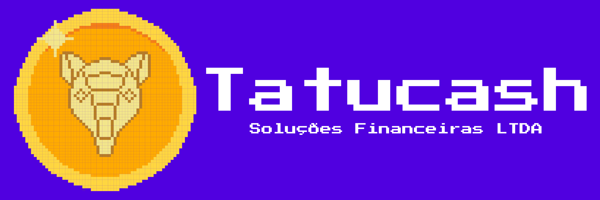
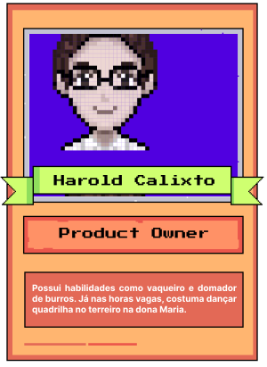
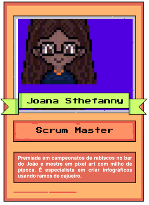
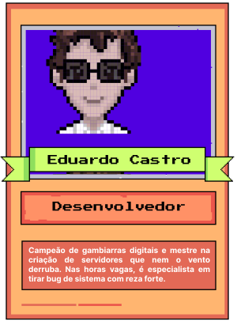
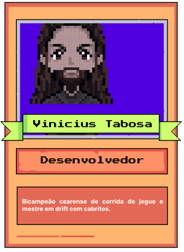
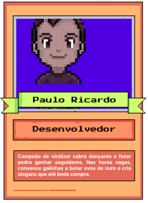

  
  <h1> TatuCash - A plataforma para aprender se divertindo 🦔</h1>

## Descrição do Projeto ⚙

A administração da saúde financeira é um desafio enfrentado por muitos, especialmente entre as classes médias e baixas, onde a educação financeira é frequentemente insuficiente. A falta de conhecimento sobre como gerenciar as finanças pessoais pode levar a consequências graves, como endividamento crônico, falta de poupança e dificuldades para investir de maneira segura. Em uma sociedade cada vez mais complexa e interconectada, essas questões são exacerbadas pela crescente facilidade de acesso ao crédito e ao consumo desenfreado, sem o devido conhecimento sobre gestão financeira. É nesse contexto que a plataforma TatuCash, desenvolvida pela Tatucash Soluções Financeiras LTDA, se destaca como uma iniciativa crucial para difundir a educação financeira e promover a segurança econômica.

  
  <h2>TatuCash</h2>

 Tatucash é uma plataforma web que foca no aprendizado interativo do usuário, por meio de atividades com quiz e vídeos educativos, sobre educação financeira, tendo como ponto forte a identidade visual e design de nossos serviços, com foco em Pixel Art. O público-alvo da nossa empresa se concentra em pessoas com renda baixa e média, com pouco acesso a conteúdos sobre educação financeira e também para pessoas que precisam de uma linguagem mais simples e acessível, além de não compreenderem tanto de tecnologias.

  

## Site TatuCash 🚀

 Neste link você irá acessar e interagir com a plataforma web do projeto TatuCash!

- Link: [🔗 Site TatuCash](https://tatu-cash.vercel.app)

## Documentações 📝

 Neste link você irá conferir toda a documentação o projeto TatuCash!

- Link: [🔗 Documentação do Projeto](https://drive.google.com/file/d/12SSH6D-lhA6y12f0s8stW6L4A3DoM_0T/view?usp=sharing)

## Protótipo do Projeto 🎨

 Neste link você irá visualizar o protótipo de alta fidelidade do projeto TatuCash!

- Link: [🔗 Protótipo no Figma](https://www.figma.com/design/2B7cQjfHLXJ7EPnK99joBW/Prot%C3%B3tipo?node-id=0-1&t=WQLXyPlKRDhkqQWk-1)

## Tecnologias e Ferramentas Utilizadas 🔧

  
  
  
  
  
  
  
  
  
  
  
  
  
  

Para criar um ambiente adequado de desenvolvimento em React, executamos os seguintes passos

### Instalação do NodeJS

- O React é construído com o Node.js, então você precisará instalá-lo primeiro. Vá para https://nodejs.org/ e baixe o instalador para o seu sistema operacional.
- Siga as instruções do instalador para instalar o Node.js e o npm.
- Verifique se o Node.js e o npm foram instalados corretamente executando os seguintes comandos no seu terminal:

~~~
node -v
npm -v
~~~

### Editor de código

Escolha um editor de código de sua preferência. Algumas opções populares incluem o Visual Studio Code, Sublime Text, Atom, entre outros. Você pode baixar e instalar o Visual Studio Code em https://code.visualstudio.com/.

### Criação do Projeto

Utilizando o servidor de desenvolvimento Vite, utiliza-se o seguinte comando para criação do projeto na pasta de escolha

~~~
npm create vite@latest nome-do-projeto -- --template react
~~~

Agora, no projeto aberto, execute o seguinte comando para instalar todas as dependências do Vite para rodar o React

~~~
npm install
~~~

### Instalação das bibliotecas usadas no projeto

Bibliotecas para compor o Slider

~~~
npm install react-slick slick-carousel
~~~

Biblioteca para criar e gerenciar as rotas

~~~
npm install react-router-dom
~~~

## Executando o Projeto ⏳

Para executar o projeto, realize as seguintes etapas:

### Clone do repositório

- Verifique se o git está instalado na sua máquina
- Digite o comando via terminal

~~~
git clone https://github.com/thecastrodev/TatuCash.git
~~~

### Instalação das dependências

Utilize o seguinte comando para instalar todas as dependências necessárias para o funcionamento da aplicação

~~~
npm install
~~~

### Execução

Em seguida, digite o comando para executá-lo

~~~
npm run dev
~~~

Por fim, copie e cole o link gerado no terminal no seu navegador

## Time 7 (Módulo Juazeiro do Norte) - Mandacaru.Dev 🌵

<table align="center">
<tr>
  <td align="center"><a href="https://github.com/haroldcalixto"> <b>Harold Calixto</b></a> 
👨‍💻
</td>
  <td align="center"><a href="https://github.com/JoanaSthefanny"> <b>Joana Sthefanny</b></a> 
👩‍💻
</td>
  <td align="center"><a href="https://github.com/thecastrodev"> <b>Eduardo Castro</b></a> 
👨‍💻
</td>
  <td align="center"><a href="https://github.com/ViniciusTabosa"> <b>Vinícius Costa</b></a> 
👨‍💻
</td>
  <td align="center"><a href="https://github.com/prsousa8"> <b>Paulo Ricardo</b></a> 
👨‍💻
</td>
</tr>
</table>
